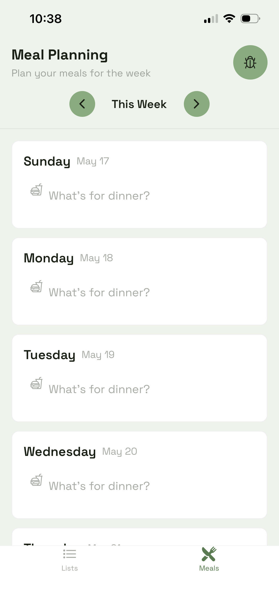

# Gliso — Grocery List App

A personal iOS app I designed and built to solve a real household pain point: making and using a grocery list

**Built with:** Replit · React Native · Expo · EAS Build · TestFlight

---

## The Problem
All the grocery list apps I've tried are buggy, too basic, or too complicated.  I wanted something that would get me through the hassle of making and using a grocery list as fast as possible, without the fluff.

## The Solution
Gliso is a grocery list app that is laser focused on helping you build and use your grocery list in the fastest way possible.  It tries to speed up the list creation process and the in-store list crossing-off process.

## Screenshots

### Home / Grocery List

This is the core List tab where users make and use their list.  Adding items and crossing them off.

### Meal Planner

This is the meal planning tab that supports list making.  It helps you remember the meals you planned for the week so you can list their ingredients.
---

## Product Decisions Worth Noting
So far I've erred on the side of simplicity and not adding complex features like gleaning ingredients from online recipes.  I believe that I need to get the core experience fast and correct first.  If I can achieve that, then I can explore if more complex features can be added to further speed up list-making and list-using without bloating the app and putting too much burden on the user.

## AI-Assisted Development
This project doubles as a hands-on exploration of AI-accelerated product work. 
I use Claude for architecture problem-solving and document the process in a 
[LinkedIn series](https://docs.google.com/document/d/19yY9sF7uinFKgNoWHYE78fOAtjUGvSQxLK89BLCASp0/edit?usp=sharing).
